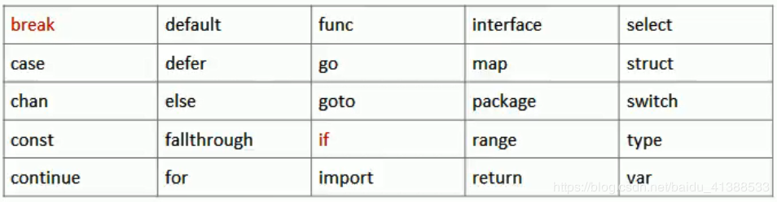
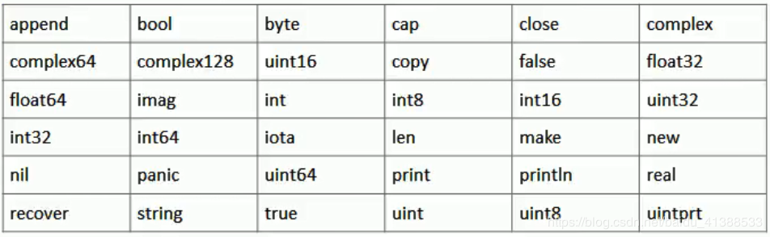

## 2.2 基础：开发规范/系统预留


#### 1) 语言结构
```
package main   // 包声明, 以下代码都包含到这个包中

import "fmt"   // 引入包, 去实现某些函数 

func main() {                        // ('{' 不能在单独的行上)
   var name int = 3                  // 变量
   fmt.Println("Hello ==> %d", name) //表达式
}

/* 这是第一个程序 */      // 注释
```


#### 2) 开发规则/风格
**规则**
* 源文件要以 .go 结尾   
* 应用程序执行入口是 main 函数   
* 严格区分大小写
* Go 每个语句后不加分号(编译器会自动给加上)
* Go 由一条条独立语句构成, 不能多条语句一行
* Go 定义的变量或者import的包, 没有使用到会报错

**风格**
* 官方推荐行注释, 非块注释
* 正确缩进和空白 (vs下选中 shift+tab左移, 然后tab右移)
* 运算符两边加空格
* 一行最长不超过80字符


#### 3) 标识符
Go 中对变量/方法/函数等命名时的字符成为标识符(凡是可以取名都叫标识符)

**命名规则**    
* 大小写字母/下划线/数字组成
* 第一个字符不能是数字，不能包含空格
* 严格区分大小写
* 不能以系统保留关键字作为标识符
    
**命名规范**     
* 包名保持和目录名对应(简短/清晰/有意义)    
* 变量名/函数名/常量名等，采用驼峰法 (xxxYyyZzz)    
* 变量名/函数名/常量名等，首字母大写则可以被其他包引用，否则只能在本包中使用    

#### 4) 系统保留关键字(25)   



#### 5)系统预定义标识符(36)    


