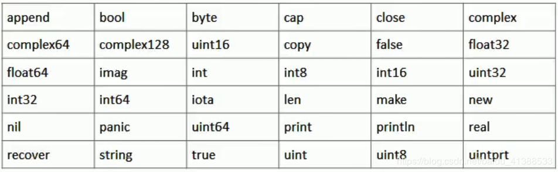

## 2.02 语言基础：go

##### 1. 语言背景

1. 硬件更新频繁，性能提高很快，但是编程语言却赶不上脚步，不能合理利用多核 CPU
2. 软件系统复杂度太高，现有语言风格不统一，计算能力不够，处理大并发不好
3. 有的语言编译快但执行效率慢(java)，有的执行效率高编译慢(c++)，需要一个平衡利弊得语言

**作者**

- Ken Thompson (unix 之父 B 语言之父 飞行员)
- Rob Pike (unix 开发者 utf-8 设计者 天文学家 射箭银牌 )
- Robert Griesemer (低调 boy)

#### 2. 语言特性

google 2007 年创建, 2009 年发布第一版 (几乎保持一年两次小版本更新)  
它是一种静态强类型、编译型、并发型、并具有垃圾回收功能的编译型语言  
它能让构造简单、可靠且高效的软件变得容易

目标：是“兼具 Python 等动态语言的开发速度和 C/C++ 等编译型语言的性能与安全性”  
思想：每一个问题尽量只有一个解决方法

优势：

1. 语法简单
2. 高效安全 (有静态语言 c 的安全和运行速度+动态语言 python 的开发效率, 在开发/编译/执行做了最佳平衡)
3. 天然并发 (语言层面支持 + gorouting + cps 并发模型 + 管道通信)
4. 垃圾回收 (自动处理机制)
5. 内存管理 (tcmalloc)
6. 新的创新 (切片 + deter 延时 + 函数返回多个值 + 包的概念 + 标准库等)

#### 3. 语言结构

```
package main   // 包声明, 以下代码都包含到这个包中

import "fmt"   // 引入包, 去实现某些函数

func main() {                        // ('{' 不能在单独的行上)
   var name int = 3                  // 变量
   fmt.Println("Hello ==> %d", name) //表达式
}

/* 块注释 */
// 行注释

运行：go run xxx.go
```

#### 5. 开发规则/风格

**规则**

- 源文件要以 .go 结尾
- 应用程序执行入口是 main 函数
- 严格区分大小写
- Go 每个语句后不加分号(编译器会自动给加上)
- Go 由一条条独立语句构成, 不能多条语句一行
- Go 定义的变量或者 import 的包, 没有使用到会报错

**风格**

- 官方推荐行注释, 非块注释
- 正确缩进和空白 (vs 下选中 shift+tab 左移, 然后 tab 右移)
- 运算符两边加空格
- 一行最长不超过 80 字符

#### 6. 标识符

Go 中对变量/方法/函数等命名时的字符成为标识符(凡是可以取名都叫标识符)

**命名规则**

- 大小写字母/下划线/数字组成
- 第一个字符不能是数字，不能包含空格
- 严格区分大小写
- 不能以系统保留关键字作为标识符

**命名规范**

- 包名保持和目录名对应(简短/清晰/有意义)
- 变量名/函数名/常量名等，采用驼峰法 (xxxYyyZzz)
- 变量名/函数名/常量名等，首字母大写则可以被其他包引用，否则只能在本包中使用

#### 7. 系统保留关键字(25)


#### 8. 系统预定义标识符(36)


