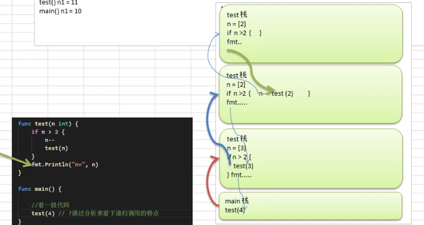
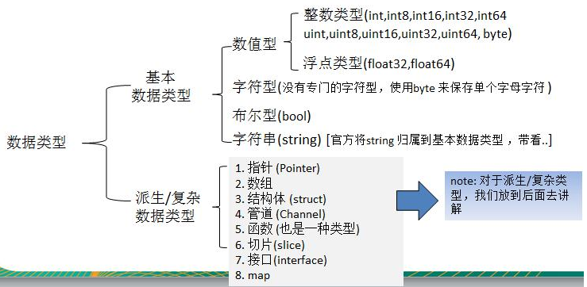

## 2.3 基础：内置类型和函数

#### 1) 内置类型
```
// 值类型：变量直接存储值，内存通常在栈中分配
bool
int(32 or 64), int8, int16, int32, int64
uint(32 or 64), uint8(byte), uint16, uint32, uint64
float32, float64
string
complex64, complex128
array    -- 固定长度的数组

// 引用/指针类型：变量存储地址，内存通常在堆中分配，若没被引用，则是垃圾地址被回收
slice   -- 序列数组(最常用)
map     -- 映射
chan    -- 管道
指针
接口interface
```

#### 2) 内置函数
go 语言有不需要导入就可以使用的内置函数，如下
```
append          -- 用来追加元素到数组、slice中,返回修改后的数组、slice
close           -- 主要用来关闭channel
delete          -- 从map中删除key对应的value
panic           -- 停止常规的goroutine  （panic和recover：用来做错误处理）
recover         -- 允许程序定义goroutine的panic动作
real            -- 返回complex的实部   （complex、real imag：用于创建和操作复数）
imag            -- 返回complex的虚部
make            -- 用来分配内存，返回Type本身(只能应用于slice, map, channel)
new             -- 用来分配内存，主要用来分配值类型，比如int、struct。返回指向Type的指针
cap             -- capacity是容量的意思，用于返回某个类型的最大容量（只能用于切片和 map）
copy            -- 用于复制和连接slice，返回复制的数目
len             -- 来求长度，比如string、array、slice、map、channel ，返回长度
print、println  -- 底层打印函数，在部署环境中建议使用 fmt 包

```

#### 3) 内置接口 error
```
type error interface { //只要实现了Error()函数，返回值为String的都实现了err接口
   Error()    String
}
```

#### 4) init 函数和 main 函数
**a、init 函数**   
* init函数是用于程序执行前做包的初始化的函数，比如初始化包里的变量
* 每个包可以拥有多个init函数
* 包的每个源文件也可以拥有多个init函数

* 同一个包中多个init函数的执行顺序go语言没有明确的定义(说明)
* 不同包的init函数按照包导入的依赖关系决定该初始化函数的执行顺序
* init函数不能被其他函数调用，而是在main函数执行之前，自动被调用


**b、main 函数**
go 程序的默认入口函数
func main() {
    // 函数体
}

**c、init 和 main 不同点**
```
相同点：
两个函数定义时，不能有任何的参数和返回值，且go自动调用

不同点：
init 可以应用在任意包中，且可以重复定义多个
main 函数只能用于 main 包，且只能定义一个

执行顺序：
同一个 go 文件中 init() 调用是从上到下
同一个 package 不同文件，按文件名字符串从小到大顺序调用 各文件中init()
不同的 package ，按照 main 中 import 的顺序调用，若存在依赖，先调用依赖

```

#### 5) len/new/make

```
package main
import "fmt"

func main() {
    // 1. len函数，求string/array/map等长度

    // 2. new 函数分配内存空间(对值类型)，存放地址，返回指针值。而该指针又指向一个值类型的值
    n1 := 100
    fmt.Printf("n1 type is %T, n1 value is %v, n1 addr is %v\n", n1, n1, &n1)

    n2 := new(int)
    fmt.Printf("n2 type is %T, n2 value is %v, n2 addr is %v, n2 指针的值 %v\n", n2, n2, &n2, *n2)

    // 修改 n2 的值
    *n2 = 200
    fmt.Printf("n2 type is %T, n2 value is %v, n2 addr is %v, n2 指针的值 %v\n", n2, n2, &n2, *n2)

    // 3. make 函数分配地址空间(对引用类型)，

}

>>>
n1 type is int, n1 value is 100, n1 addr is 0xc0000120b0
n2 type is *int, n2 value is 0xc0000120c8, n2 addr is 0xc000006030, n2 指针的值 0
n2 type is *int, n2 value is 0xc0000120c8, n2 addr is 0xc000006030, n2 指针的值 200
```




#### 6) 数据类型分类


