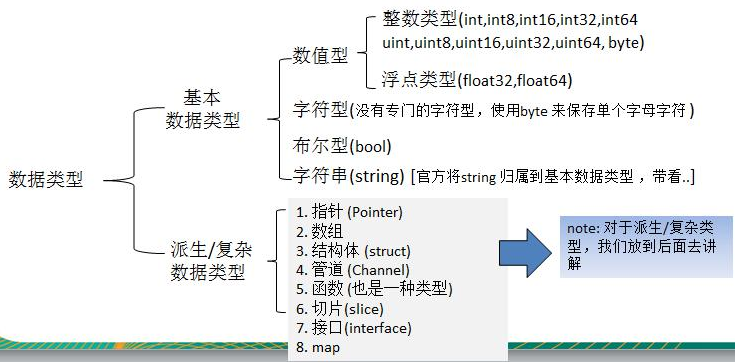

## 3.00 数据结构：汇总

#### 1. 数据类型分类



#### 2. 数据结构分类

```
// 值类型：变量直接存储值，内存通常在栈中分配
bool
int(32 or 64), int8, int16, int32, int64
uint(32 or 64), uint8(byte), uint16, uint32, uint64
float32, float64
string
complex64, complex128
array    -- 固定长度的数组

// 引用/指针类型：变量存储地址，内存通常在堆中分配，若没被引用，则是垃圾地址被回收
slice   -- 序列数组(最常用)
map     -- 映射
chan    -- 管道
指针
接口interface
```

#### 3. 内置函数

go 语言有不需要导入就可以使用的内置函数，如下

```
append          -- 用来追加元素到数组、slice中,返回修改后的数组、slice
close           -- 主要用来关闭channel
delete          -- 从map中删除key对应的value
panic           -- 停止常规的goroutine  （panic和recover：用来做错误处理）
recover         -- 允许程序定义goroutine的panic动作
real            -- 返回complex的实部   （complex、real imag：用于创建和操作复数）
imag            -- 返回complex的虚部
make            -- 用来分配内存，返回Type本身(只能应用于slice, map, channel)
new             -- 用来分配内存，主要用来分配值类型，比如int、struct。返回指向Type的指针
cap             -- capacity是容量的意思，用于返回某个类型的最大容量（只能用于切片和 map）
copy            -- 用于复制和连接slice，返回复制的数目
len             -- 来求长度，比如string、array、slice、map、channel ，返回长度
print、println  -- 底层打印函数，在部署环境中建议使用 fmt 包
```

#### 4. new/make

make 和 new 的区别：  
make 被用来分配引用类型的内存： map, slice, channel  
new 被用来分配除了引用类型的所有其他类型的内存： int, string, array 等

#### 5. init 函数和 main 函数

**a、init 函数**

- init 函数是用于程序执行前做包的初始化的函数，比如初始化包里的变量
- 每个包可以拥有多个 init 函数
- 包的每个源文件也可以拥有多个 init 函数

- 同一个包中多个 init 函数的执行顺序 go 语言没有明确的定义(说明)
- 不同包的 init 函数按照包导入的依赖关系决定该初始化函数的执行顺序
- init 函数不能被其他函数调用，而是在 main 函数执行之前，自动被调用

**b、main 函数**
go 程序的默认入口函数
func main() {
// 函数体
}

**c、init 和 main 不同点**

```
相同点：
两个函数定义时，不能有任何的参数和返回值，且go自动调用

不同点：
init 可以应用在任意包中，且可以重复定义多个
main 函数只能用于 main 包，且只能定义一个

执行顺序：
同一个 go 文件中 init() 调用是从上到下
同一个 package 不同文件，按文件名字符串从小到大顺序调用 各文件中init()
不同的 package ，按照 main 中 import 的顺序调用，若存在依赖，先调用依赖

```
