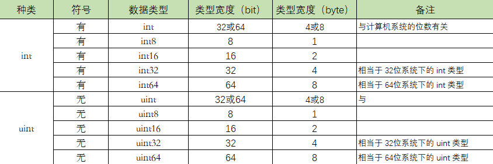

## 3.1 基本类型：数值/布尔

#### 1. 整数类型


**a) 整型类型**      
int   是有符号，表示正数 + 负数。 int8 = -128-127       
uint  是无符号，能表示的都是正数，uint8 = 0-255 = 2的8次方 = 256个数     
rune  等价 int32，表示一个unicode码       
byte  8bit = 1byte，通常用于表示年龄类型       

**b) int 没有并没有指定它的位数，那它的大小，是根据什么变化呢？**            
当你在32位的系统下，int 和 uint 都占用 4个字节，也就是32位。    
若你在64位的系统下，int 和 uint 都占用 8个字节，也就是64位。     
所以为避免某些情况最好用更加精确的 int32 和 int64      

**c) 不同进制表示方法**   
https://go-zh.org/pkg/fmt/
```
import (
    "fmt"
)

func main() {
    var num01 int = 0b1100
    var num02 int = 0o14
    var num03 int = 0xC

    fmt.Printf("2进制数 %b 表示的是: %d \n", num01, num01)
    fmt.Printf("8进制数 %o 表示的是: %d \n", num02, num02)
    fmt.Printf("16进制数 %X 表示的是: %d \n", num03, num03)
}

output:
2进制数 1100 表示的是: 12
8进制数 14 表示的是: 12
16进制数 C 表示的是: 12

```


#### 2. 浮点型
语言中提供了两种精度的浮点数 float32 和 float64。

float32 单精度，存储占4个字节，也即4*8=32位，1位符号，8位指数，剩下的23位表示尾数


float64，双精度，存储占8个字节，也即8*8=64位，其中1位符号，11位指数，52位表示尾数


**a) float32 和 float64 可以表示的数值范围**        
常量 math.MaxFloat32 表示 float32 能取到的最大数值，大约是 3.4e38；     
常量 math.MaxFloat64 表示 float64 能取到的最大数值，大约是 1.8e308；      
float32 和 float64 能表示的最小值分别为 1.4e-45 和 4.9e-324。      

**b) float32 和 float64 可以表示的精度范围            
float32 可以提供大约 6 个十进制数的精度        
float64 可以提供约 15 个十进制数的精度      


**c) float 类型是可能对精度有损失的 (重点)**     

```
package main
import (
    "fmt"
    "math"
)
func main() {
    fmt.Printf("%f\n", math.Pi)
    fmt.Printf("%.2f\n", math.Pi)
}
```

#### 3. bool类型

* 一个布尔类型的值只有两种：true 或 false。     
* if 和 for 语句的条件部分都是布尔类型的值    
* 布尔型无法参与数值运算，也无法与其他类型进行转换。


```
var aVar = 10
aVar == 5  // false
aVar == 10 // true
aVar != 5  // true
aVar != 10 // false

import "fmt"

var age int = 15
var gender string = "male"
func main()  {
    //  && 两边的表达式都会执行
    fmt.Println( age > 18 && gender == "male")

    // gender == "male" 并不会执行
    fmt.Println( age < 18 || gender == "male")
}

>>> 
false
true


// 函数实现bool类型转换
func bool2int(b bool) int {
    if b {
        return 1
    }
    return 0
}

func int2bool(i int) bool {
    return i != 0
}

```

