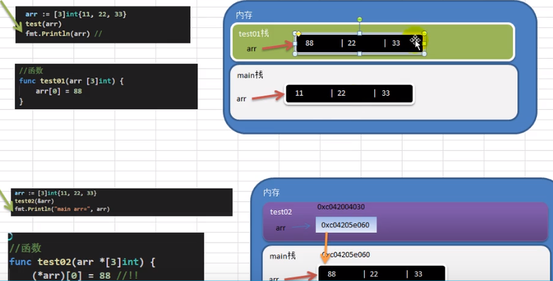

## 3.3 派生类型：数组与切片

#### 1. 数组

* 数组 长度/数据类型 一旦固定，不能变动
* 数组 没有赋值则为零值，数值=0  字符串="" bool=false
* 数组 是值类型(其他语言数组是引用类型)，说明只能值拷贝，不会影响原有数组
* 数组 如果要改变数组，需要使用指针


##### 定义数组
```
// 原始方法
var arr [3]int = [3]int{1,2,3}

// 第二种方法  用这种方法就挺好
arr := [3]int{1,2,3}    

// 第三种方法
arr := [...]int{1,2,3}  // 指定索引对应数字 arr := [...]int{1: 10, 2: 100, 0: 50}   

// 第四种方法  定义别名
type arr3 [3]int
myarr := arr3{1,2,3}
```

##### 数组内存分布 


```
package main
import "fmt"

func main() {
    var intArr [3]int     // int占8个字节(因为系统是int64) ，int32占4个字节

    fmt.Println(intArr)

    // 元素0的地址就是数组的地址，元素1地址是元素0地址加上字节数     (用指针去查是最快的，但要掌握占位字节规律)
    fmt.Printf(" intArr[ ]地址是%p,\n intArr[0]地址是%p,\n intArr[1]地址是%p,\n intArr[2]地址是%p\n", &intArr, &intArr[0], &intArr[1], &intArr[2])

}

>>>
[0 0 0]
 intArr[ ]地址是0xc0000103e0,
 intArr[0]地址是0xc0000103e0,
 intArr[1]地址是0xc0000103e8,
 intArr[2]地址是0xc0000103f0
```

##### 数组案例

**a) 打印出26个英文大写字母 (使用了for-range 循环)** 
```
package main
import "fmt"

func main() {

    // 循环类型 第一种
    var arr [26]byte
    for i := 0; i < len(arr); i++ {
        arr[i] = 'A' + byte(i)    // 需要将i的int转为byte
        fmt.Printf("%c", arr[i])
    }

    fmt.Printf("\narr=%v\n", arr)
    fmt.Printf("arr=%c\n", arr)

    // 循环类型 第二种
    for i, v :=  range arr {
        fmt.Printf("%v=%c ", i, byte(v))    //默认v输出的是acsii码
    }
}

>>>
ABCDEFGHIJKLMNOPQRSTUVWXYZ
arr=[65 66 67 68 69 70 71 72 73 74 75 76 77 78 79 80 81 82 83 84 85 86 87 88 89 90]
arr=[A B C D E F G H I J K L M N O P Q R S T U V W X Y Z]
0=A 1=B 2=C 3=D 4=E 5=F 6=G 7=H 8=I 9=J 10=K 11=L 12=M 13=N 14=O 15=P 16=Q 17=R 18=S 19=T 20=U 21=V 22=W 23=X 24=Y 25=Z
```

**b) 声明一个数组，找出最大的值放到下标0**
```
package main
import "fmt"

func main() {

    arr := [...]int{1, -1, 10, 50, 100}
    max := arr[0]
    maxIndex := 0

    for i := 1; i < len(arr); i++ {
        if max < arr[i] {
            max = arr[i]
            maxIndex = i
        }
    }
    fmt.Printf("max=%v, maxIndex=%v\n", max, maxIndex)
}

>>>
max=100, maxIndex=4
```

**c) 循环求平均数  （采用了像函数传递数组）**
```
// 方式一 形参设定数组大小
void myFunction(param [10]int)  {  }

// 方式二 形参未设定数组大小
void myFunction(param []int)  {  }

--------------
package main
import "fmt"

func getAverage(arr [5]int, size int) float32 {
   var sum int

   for i := 0; i < size;i++ {
      sum += arr[i]
   }
   return float32(sum) / float32(size)
}

func main() {
   var  arr = [5]int{1, 2, 3, 5, 10}         // 定义数组长度为5
   avg := getAverage( arr, len(arr) )        // 数组作为参数传递给函数 
   fmt.Printf( "avg=%v \n", avg)
}

>>>
avg=4.2
```

**d) 随机生成五个数，并将其反转打印**
```
package main
import (
    "fmt"
    "math/rand"
    "time"
)

func main() {
    var arr [5]int

    // 为了每次生成随机数不一样，需要给定seed
    rand.Seed(time.Now().Unix())
    for i := 0; i < len(arr) - 1; i++ {
        arr[i] = rand.Intn(100)     // 0<n<100 获取随机数函数
    }

    fmt.Printf("arr=%v\n", arr)

    // 进行反转，倒过来打印并赋给新的数组
    var arry2 [5]int
    for i := 0; i < len(arr); i++ {
        arry2[i] = arr[len(arr) -1 -i] 
    } 
    fmt.Printf("arry2=%v\n", arry2)
}

>>>
arr=[93 52 82 22 0]
arry2=[0 22 82 52 93]
```

#### 2. 多维数组

##### 数组定义
```
// 二维数组
var twodim [5][4]int

// 三维数组
var threedim [5][10][4]int

a = [3][4]int{  
 {0, 1, 2, 3} ,   // 第一行索引为 0 
 {4, 5, 6, 7} ,   // 第二行索引为 1
 {8, 9, 10, 11},  // 第三行索引为 2 
}

val := a[2][3]   //赋值第三行第四个元素给val
```


##### 数组内存分布


##### 案例
```
package main
import (
	"fmt"
)

func printSlice(x []int){
	fmt.Printf("len=%d cap=%d slice=%v\n",len(x),cap(x),x)
}

func main() {
	// 二维数组   5 行 2 列
       var a = [5][2]int{ {0,0}, {1,2}, {2,4}, {3,6},{4,8}}
       var i, j int
   
       /* 输出数组元素 */
       for  i = 0; i < 5; i++ {
          for j = 0; j < 2; j++ {
             fmt.Printf("a[%d][%d] = %d\n", i,j, a[i][j] )
          }
       }
}

>>>
a[0][0] = 0
a[0][1] = 0
a[1][0] = 1
a[1][1] = 2
a[2][0] = 2
a[2][1] = 4
a[3][0] = 3
a[3][1] = 6
a[4][0] = 4
a[4][1] = 8

```


#### 3. 切片

* 切片 是引用类型，所以可以直接修改值
* 切片 可以容纳元素的容器(同数组)，长度可变，so无法通过类型确定其值长度
* 切片 索引第一位不写默认为0/start，最后一位不写默认len(arr)/end
* 切片 可以对切片继续切片

* 原理 切片的操作就是对 底层的数组操作，扩容的话会新创建一个数组，在把切片引用到扩容后的数组     

**string 与 slice：**         
string 底层是byte数组，也可以做切片，string本身不可变 (可以转换为[]byte []rune切片才能更改)  
```
str := "hello@123"
arr := []byte{str}     // 如果有中文，则应该用 []rune{str}
arr[0] = 'z'
str = string(arr)
```

##### 切片定义

**面试1 方式一和方式二的区别**     
方式一直接引用，数组实现存在，程序员可见   
方式二make创建，make也会创建数组，由切片在底层维护，程序员不可见     
  
```
// 方式一：直接引用数组
arr := [3]int{1, 2, 3}
slice := arr[1:2]

// 方式二：make函数 
var myslip []type = make( []Type, size, cap ) 
slice1 := make( []Type, size, cap )

// 方式三：
var identifier []int  = []int{1, 2, 3}
slice1 := []int{1, 2, 3}
var numListEmpty = []int{}    //空切片

```

##### 切片内存分布


##### 切片截取/添加
**a) len() 和 cap() 函数**     
len = 长度。表示公司有多少员工 ，会取截取的片段，索引0是元素1的位置         
cap = 容量。表示公司可以容纳多少员工，会从截取起始到原数组终止索引     

注意：终止索引标识项不包括在切片内，即左闭右开  

```
myarr := [5]int{1,2,3,4,5}
fmt.Printf("myarr 的长度为：%d，容量为：%d, slice=%v\n", len(myarr), cap(myarr), myarr)

mysli := myarr[1:3]
fmt.Printf("mysli 的长度为：%d，容量为：%d, slice=%v\n", len(mysli), cap(mysli), mysli)

>>> 
myarr 的长度为：5，容量为：5, slice=[1,2,3,4,5]
mysli 的长度为：2，容量为：4, slice=[2,3]
```

**b) append() 和 copy() 函数**
```
/* 同时添加多个元素 */
numbers = append(numbers, 2,3,4)

/* 拷贝 numbers 的内容到 numbers1 */
copy(numbers1,numbers)
```

#####  案例


```
package main

import (
	"fmt"
)

func printSlice(x []int){
	fmt.Printf("len=%d cap=%d slice=%v\n",len(x),cap(x),x)
}

func main() {
	type arr4 [6]int                  //别名类型 定义数组
	arr03 := arr4{5,6,7,8,9,10}

	// 切片
	slip01 := arr03[1:3]       // 切片截取
	printSlice(slip01)

	// make
	m1 := make([]int, 2)       // 切片定义 
	m2 := make([]int, 2, 10)
	printSlice(m1)
	printSlice(m2)

	// append copy
	slice := []int{1}
	slice = append(slice, 2)    //追加一个元素
	printSlice(slice)

	slice = append(slice, 3, 4)
	printSlice(slice)

	slice = append(slice, []int{7, 8}...)   //追加一个切片，...表示解包，不能省略
	printSlice(slice)

	slice = append([]int{0}, slice...)       //在前边插入一个切片
	printSlice(slice)

	slice = append(slice[:5], append([]int{5,6}, slice[5:]...)...)  //中间插入一个切片
	printSlice(slice)

	slice2 := make([]int, len(slice), (cap(slice))*2)    /* 创建切片 numbers1 是之前切片的两倍容量*/
	copy(slice2,slice)     /* 拷贝 numbers 的内容到 numbers1 */
	printSlice(slice2)
}

输出：

len=2 cap=5 slice=[6 7]
len=2 cap=2 slice=[0 0]
len=2 cap=10 slice=[0 0]
len=2 cap=2 slice=[1 2]
len=4 cap=4 slice=[1 2 3 4]
len=6 cap=8 slice=[1 2 3 4 7 8]
len=7 cap=8 slice=[0 1 2 3 4 7 8]
len=9 cap=16 slice=[0 1 2 3 4 5 6 7 8]
len=9 cap=32 slice=[0 1 2 3 4 5 6 7 8]

```
