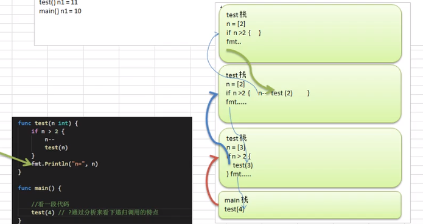

## 5.4 函数：匿名/闭包/递归


#### 1. 匿名函数

* 如果该函数只调用一次，则可以使用匿名函数

```
package main
import "fmt"

var (
    // 全局函数第一个字母要大些
    Fun1 = func (n1 int, n2 int) int {
        return n1 * n2
    }
)

func main() {
    // 第一种方式 (相对多一点)
    res1 := func (n1 int, n2 int) int {
        return n1 + n2
    }(10, 20)
    fmt.Printf("res1=%v\n", res1)

    // 第二种，匿名函数赋给变量
    a := func (n1 int, n2 int) int {
        return n1 + n2
    }
    res2 := a(10, 20)
    fmt.Printf("res2=%v\n", res2)
    res3 := a(20, 30)
    fmt.Printf("res3=%v\n", res3)

    //第三种， 全局匿名函数的使用
    res4 := Fun1(3, 4)
    fmt.Printf("res4=%v\n", res4)

}

>>>
res1=30
res2=30
res3=50
res4=12
```


#### 2. 闭包

闭包：一个函数 与 其相引用的环境 组合的一个整体

* 返回的是一个匿名函数，而这个匿名函数引用到函数外的n，则这个函数和n就形成一个整体，构成闭包
* 理解：闭包是类，函数是操作，n是字段，函数和它使用n构成闭包
* 反复调用时，n初始化一次，每调用一次进行一次累计

闭包能不能理解成一个累加器

```

package main
import "fmt"

func Addupper()  func (int) int {
    var n int = 10
    var str = "hello"
    return func (x int) int {
        n = n + x
        str += "a"
        fmt.Println("str=", str)
        return n
    }
}

func main() {
    f := Addupper()
    fmt.Println(f(1))
    fmt.Println(f(3))
}
>>>
str= helloa
11
str= helloaa
14
```

```
// 1) 编写一个函数 makeSuffix(suffix string) 可以接收一个文件后缀名(.jpg)，并返回一个闭包
// 2) 调用闭包，传入文件名，如果该文件没有指定后缀名则加上，
// 3) strings.HashSuffix, 该函数可以判断某个字符串是否有指定后缀

package main
import (
    "fmt"
    "strings"
)

func makeSuffix(suffix string) func (string) string {
    return func (name string) string {
        if !strings.HasSuffix(name, suffix) {
            return name + suffix
        }
        return name
    }
}

func main() {

    f := makeSuffix(".jpg")    // 有一个优势只需要调用一次
    fmt.Println("文件处理后=", f("test"))
    fmt.Println("文件处理后=", f("test.jpg"))
}

>>>
文件处理后= test.jpg
文件处理后= test.jpg
```

#### 3. 递归调用    

* 执行一个新的函数，就会产生一个新的空间栈
* 函数局部变量是相互独立的，不会互相影响
* 递归必须向着趋近于条件逼近，否则无限循环
* 函数执行完毕或者返回时，遵循谁调用返回给谁，返回后该函数空间被销毁

```
package main
import "fmt"

func test(n int) {
    if n > 2 {
        n--
        test(n)
    }
    fmt.Print("n=", n)
}
func test2(n int) {
    if n > 2 {
        n--
        test(n)
    } else {
      fmt.Print("n=", n)
    }
}
func main(){
    test(4)
    fmt.Print("----------")
    test2(4)
}

>>>
n=2
n=2
n=3
----------------
n=2
```



**a) 求斐波那契数**   
```
package main

import "fmt"

func fibonacci(n int) int {
  if n < 2 {
   return n
  }
  return fibonacci(n-2) + fibonacci(n-1)
}

func main() {
    var i int
    for i = 0; i < 10; i++ {
       fmt.Printf("%d\t", fibonacci(i))
    }
}
>>>
0    1    1    2    3    5    8    13    21    34
```

**b) 已知f(1)=3 f(n)=2*f(n-1)+1, 求f(n)的值**

```
package main
import "fmt"

func f(n int) int{
    if n == 1 {
        return 3
    } else {
        return 2 * f(n-1) + 1
    }
}
func main() {
    fmt.Println("f(1)=", f(1))
    fmt.Println("f(5)=", f(5))
}
>>>
f(1)=3
f(5)=63    //2*f(4)+1 == 2*(2*f(3)+1)+1 == 2*(2* (2* (2* f(1) +1) +1) +1)+1
```

**c) 猴子吃桃子，第一天吃了一半外加一个，以后每天都吃一半外加一个，第十天时，桃子成了一个，问最初多少个桃子**
```
package main
import "fmt"

func tao(days int) int {
    if days == 10 {
        return 1
    } else {
        return (tao(days+1) + 1) * 2 
    }
}

func main() {
    fmt.Println("最初的桃子数量", tao(1))
}

>>> 
最初的桃子数量 1534
```

