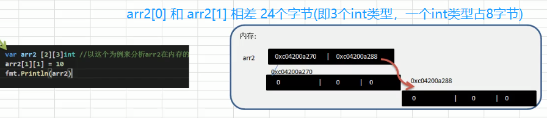

## 1.1 派生类型: 结构体(struct) 

#### 1. 结构体定义

之前的数据类型中，数组与切片，只能存储同一类型的变量。若要存储多个类型的变量，就需要用到结构体，    
 
* 结构体是值类型，不同结构体变量是独立的，一个结构体字段更改，不会影响另外一个
* 结构体在内存中是连续的
* 结构体是用户单独定义的类型，和其他类型转换时需要完全相同的字段(名字 个数 类型)
* 结构体体使用type重新定义后，golang会认为是新的数据类型，但是可以强转的
* 结构体的每个字段都可以用tag(别名)，供其它语言调用，并进行序列化和反序列化

```
type Person struct {
    属性名  属性类型  
    Name   string   `json: "name"`   //这就是结构体的tag
    Age    int
    color  string
    ...
}

// 第一种方式
var p1 Person
p1["Age"] = 20     

// 第二种方式  创建变量时把字段和值写到一块, 可以不关心顺序
p2 := Person{Age: 20, Name: "tom"}  ==  var p2 = Person{Age: 20, Name: "tom"}

// 第三种方式  创建变量时把值放进去
p3 := Person{"tom", 20}    ==  var p3 = Person{"tom", 20} 

// 第四种方式 返回结构体指针(重要!!) p4 -->地址-->数据结构体
p4 := &Person{"tom", 20}   
p4 := &Person{Age: 20, Name: "tom"}  

// 第五种方式
p3 := new(Person)
```




#### 2. 结构体的使用

以下示例包含：    
* 访问结构体方式 (结构体.成员名)
* 结构体    作为参数传递给函数
* 结构体指针作为参数传递给函数
* Go 无法再结构体定义方法, 但可以使用组合函数定义


```
package main
import "fmt"

type Person struct {
    name  string
    age int
    scores float64
    ptr *int             //指针类型
    slice []int            //切片类型
    map1 map[string]string   //map
}

type Books struct {
   title string
   book_id int
}

func main() {
    // 结构体遇到 切片和map的使用方式
    var p1 Person
    fmt.Println(p1)

    if p1.ptr == nil {
        fmt.Println("ok1")
    }

    p1.name = "teng"
    p1.slice = make([]int, 10)   // 使用slice，一定要先make
    p1.slice[0] = 100 

    p1.map1 = make(map[string]string)    // 使用map，一定也要先make
    p1.map1["keys"] = "tom"

    fmt.Println(p1)

    //  结构体与函数的使用方式
    var Book1 Books        /* 声明 Book1 为 Books 类型 */
    var Book2 Books        /* 声明 Book2 为 Books 类型 */
 
    Book1.title = "Go 语言"
    Book1.book_id = 6495407
 
    Book2 = Books{title: "Python 教程", book_id: 6495700}
 
    // 结构体  作为参数传给函数
    printBook(Book1)
    printBook(Book2)
     
    // 结构体指针 作为参数传给函数
    printBook2(&Book1)
    printBook2(&Book2)
 
    // 定义一个与 Books 的绑定的方法
    Book1.FmtProfile()
    Book2.FmtProfile()
}

func printBook( book Books ) {
   fmt.Printf( "Book book_id : %d  title : %s\n", book.book_id, book.title)
}

func printBook2( book *Books ) {
   fmt.Printf( "Book book_id : %d  title : %s\n", book.book_id, book.title)
}

func (printBook3 Books) FmtProfile() {
    fmt.Printf( "Book book_id : %d  title : %s\n", printBook3.book_id, printBook3.title)
}

>>>
{ 0 0 <nil> [] map[]}
ok1
{teng 0 0 <nil> [100 0 0 0 0 0 0 0 0 0] map[keys:tom]}
Book book_id : 6495407  title : Go 语言
Book book_id : 6495700  title : Python 教程
Book book_id : 6495407  title : Go 语言
Book book_id : 6495700  title : Python 教程
Book book_id : 6495407  title : Go 语言
Book book_id : 6495700  title : Python 教程
```

#### 3. 组合方法实现继承

Go 语言中，把一个结构体嵌入到另一个结构体的方法，称之为组合。

```
package main

import "fmt"

type company struct {
    companyName string
    companyAddr string
}

type staff struct {
    name string
    age int
    gender string
    position string
    company
}

func main()  {
    myCom := company{
        companyName: "Tencent",
        companyAddr: "深圳市南山区",
    }
    staffInfo := staff{
        name:     "小明",
        age:      28,
        gender:   "男",
        position: "云计算开发工程师",
        company: myCom,
    }

    fmt.Printf("%s 在 %s 工作\n", staffInfo.name, staffInfo.companyName)
    fmt.Printf("%s 在 %s 工作\n", staffInfo.name, staffInfo.company.companyName)
}

>>>
小明 在 Tencent 工作
小明 在 Tencent 工作
```

