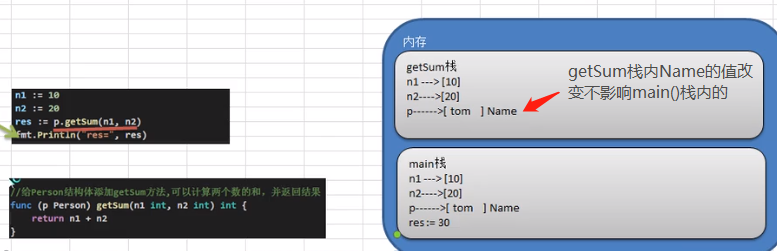

## 1.2 派生类型: 方法(method) 


#### 1. 方法的定义

在某些情况下，结构体需要有一些行为，，比如人可以说话/跑步/学习，这时就要调用方法

* 结构体 是值类型，方法调用中不改变原结构体变量值，若想改变需要用指针方式改变
* 方法是作用在指定类型上的，因此自定义类型都可以有方法，而不仅仅是struct
* 方法的调用规则符合Go规则，首字母小写只能在本包调用，首字母大写才能被其他包访问
* 如果 stu 类型实现了 string 方法，使用 fmt.Println(&stu) 就会直接调用string方法

```
func (recevier type) methodName(参数列表) (返回列表) {
    方法体
    return 返回值
}
```




#### 2. 方法与函数的区别
1. 调用方式不一样，函数==函数名(实参列表)，方法==变量.方法名(实参列表)
2. 对于普通函数，接收者为值类型时，不能将指针数据直接传递，反之亦然。但是方法却可以 (见下例)

3. 重要：p.test03() == (&p).test03() ，关键点在于方法定义时使用的是值传递还是引用传递

```
package main
import "fmt"

type Person struct {
    Name string
}

func test01(p Person) {
    fmt.Printf("test01 is %v\n", p.Name)
}
func test02(p *Person) {
    fmt.Printf("test02 is %v\n", p.Name)
}

func (p Person) test03() {
    p.Name = "jack"
    fmt.Printf("test03 is %v\n", p.Name)
}

func main() {
    var p Person
    p.Name = "tom"

    test01(p) 
    test02(&p)  
    // test02(p)   // 这样会报错

    p.test03()          // 编译器做了优化 p.test03() == (&p).test03()
    fmt.Printf("main is %v\n", p.Name)
    (&p).test03()      // 这种看似传递的时指针，也不会改变main()栈的值，因为方法定义时用的值类型传递
    fmt.Printf("main is %v\n", p.Name)
}

>>>
test01 is tom
test02 is tom
test03 is jack
main is tom
test03 is jack
main is tom
```

#### 3. 案例

**a) 熟悉方法使用方式**     
1. Person 类型绑定的方法, 其他新类型无法调用
2. test() 方法不能直接调用，必须通过Person变量来调用
3. p 是 Person 的副本，它在方法内部的改变不会影响本身的改变
4. 方法可以传参，也可以return值(retunr下面没有)

```
package main
import "fmt"

type Person struct {
    Name string
}

func (p Person) test() {          // 给 Person 类型绑定test方法, 其他新类型无法调用
    p.Name = "jack"
    fmt.Printf("test() = %v\n", p.Name)
}

func (p Person) jisuan(n int) {    // 给 Person 类型绑定jisuan方法
    res := 0
    for i := 1; i < 20; i++ {
        res += 1
    }
    p.Name = "jack"
    fmt.Printf("jisuan(%v) = %v p.Name = %v\n", n, res, p.Name)
}

func main() {
    var p Person      // 声明 p 是 Person 类型
    p.Name = "tom"

    p.test()          // 用 p 调用 test 方法 
    fmt.Printf("main() = %v\n", p.Name)

    p.jisuan(10)      // 用 p 调用 计算 方法，可传参
}

>>> 
test() = jack
main() = tom
jisuan(10) = 19 p.Name = jack
```

**b) 编写一个方法，提供m n两个参数，打印m*n的矩形**
```
package main
import "fmt"

type testType struct {
    Name string
}

func (t testType) Print(m int, n int) {
    for i := 0; i < m; i++ {
        for j := 0; j < n; j++ {
            fmt.Print("*")
        } 
    fmt.Println()
    }
}

func main() {
    var t testType
    t.Print(3, 5)
}

>>>
*****
*****
*****
```


**c) 编写一个方法，判断是奇数还是偶数**
```
package main
import "fmt"

type testType struct {
    Name string
}

func (t testType) jiou(m int) {
    if m % 2 == 0 {
        fmt.Printf("%v 是偶数\n", m)
    } else {
        fmt.Printf("%v 是奇数\n", m)
    }
}

func main() {
    var t testType
    t.jiou(3)
    t.jiou(10)
}

>>>
3 是奇数
10 是偶数
```

**d) 编写小型计算器，用一个方法实现加，用一个方法实现加减乘除**
```
package main
import "fmt"

type testType struct {
    Num1 float64
    Num2 float64
}

func (t *testType) getSum() float64 {  //得使用指针形式，要不然无法改变main()栈得原数据值
    return t.Num1 + t.Num2
}

func (t *testType) getAll(oper byte) float64 {  //得使用指针形式，要不然无法改变main()栈得原数据值
    res := 0.0
    switch oper {
        case '+' :
            res = t.Num1 + t.Num2
        case '-' :
            res = t.Num1 - t.Num2
        case '*' :
            res = t.Num1 * t.Num2
        case '/' :
            res = t.Num1 / t.Num2
        default :
            fmt.Println("运算符输入错误.....")
    }
    return res
}

func main() {
    var t testType
    t.Num1 = 1.1
    t.Num2 = 2.0
    res := t.getSum()   
    fmt.Printf("%v + %.2f = %.3f\n", t.Num1, t.Num2, res)

    var oper byte = '*'
    res2 := t.getAll(oper)
    fmt.Printf("%v %c %.2f = %.3f\n", t.Num1, oper, t.Num2, res2)
}

>>>
1.1 + 2.00 = 3.100
1.1 * 2.00 = 2.200
```
