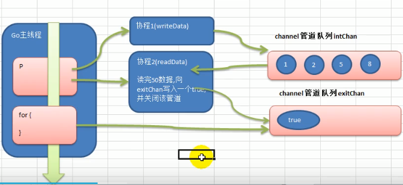
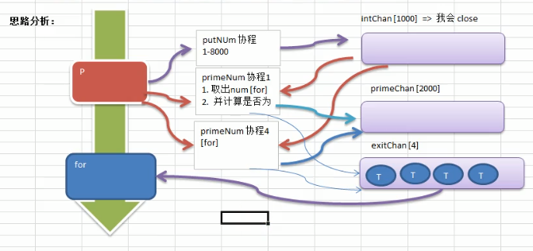

## 4.3 核心编程: 协程管道


#### 1. 协程管道写入读取 示例
需求：    
1. 开启一个 writeData 协程，写入50个整数
2. 开启一个 readData 协程，读取 writeData 写入的数据
3. 注意：两个协程操作一个管道，主线程需要等待协程都执行完再退出



```
package main
import (
    "fmt"
    "time"
)

func writeDate(intChan chan int) {
    for i := 0; i< 10; i++ {
        intChan<- i
        fmt.Println("writeDate() value = ", i)
        // time.Sleep(time.Millisecond * 10)
    }
    close(intChan)
}

func readData(intChan chan int, exitChan chan bool) {
    for {
        v, ok := <-intChan
        if !ok {
            break   // 取到末尾后，退出 for 循环
        }
        fmt.Println("readDate() value = ", v)
        time.Sleep(time.Millisecond * 10)
    }

    // 都读取完后，写一个标志符到 exitChan 管道
    exitChan<- true
    close(exitChan)
}

func main() {
    // 创建两个管道
    intChan := make(chan int, 5)   // 这样会写入5个长度后，理论上会阻塞，但是程序能识别有读程序，就不会阻塞
    exitChan := make(chan bool, 1)

    go writeDate(intChan)
    go readData(intChan, exitChan)

    for {
        _, ok := <-exitChan
        if !ok {
            break
        }
    }
    fmt.Println("退出main()")
}

>>>>
writeDate() value =  0
writeDate() value =  1
writeDate() value =  2
writeDate() value =  3
writeDate() value =  4
writeDate() value =  5
readDate() value =  0
readDate() value =  1
writeDate() value =  6
readDate() value =  2
writeDate() value =  7
writeDate() value =  8
readDate() value =  3
readDate() value =  4
writeDate() value =  9
readDate() value =  5
readDate() value =  6
readDate() value =  7
readDate() value =  8
readDate() value =  9
退出main()
```


#### 2. 协程管道求素数 示例

需求：用channel和grouting的方式，求 1-200000 内的素数并输出     

1. 开启一个协程，放入20000个数值到管道
2. 开启四个协程，读取管道数据并输出，读到xxx时候关闭，并向另一管道放入ture标志
3. 主线程需要判断另一管道存在4个true，才能执行完退出





```
package main
import (
    "fmt"
    "time"
)

func putNum(intChan chan int) {
    for i := 0; i < 10; i++ {
        intChan<- i
    }
    close(intChan)
}

func getPrime(intChan chan int, primeChan chan int, exitChan chan bool) {
    for {
        n1, ok := <-intChan
        if !ok {
            break
        }

        // 求素数/质数：只有1和它本身两个因数(乘数)的自然数
        time.Sleep(time.Millisecond * 10)
        flag := true 
        for i := 2; i < n1; i++ {
            if n1 % i == 0 {       //  该数除以小于它的任何数(1例外)，余数得0，则不为素数
                flag = false 
                break
            }
        }

        if flag {
            primeChan<- n1
        }
    }
    fmt.Println("有一个 getPrime 协程因取不到数据而退出.....")
    // 在这不能关闭管道，因为有其他协程还在取数据放入
    exitChan<- true
}

func main() {
    intChan := make(chan int, 10)
    primeChan := make(chan int, 100)  // 将计算的素数放进去
    exitChan := make(chan bool, 4)

    start := time.Now().Unix()
    go putNum(intChan)
    
    for i := 0; i < 4; i++ {
        go getPrime(intChan, primeChan, exitChan)
    }

    
    go func() {
        for i := 0; i < 4; i++ {
            <- exitChan
        }
        end := time.Now().Unix()
        fmt.Println("使用协程耗时 = ", end - start)
        close(primeChan)
    }()

    //  开始主线程
    for {
        res, ok := <-primeChan
        if !ok {
            break
        }
        fmt.Println("素数 = ", res)
    }
    fmt.Println("main() 主线程退出......")
}
>>>
素数 =  0
素数 =  2
素数 =  1
素数 =  3
素数 =  5
有一个 getPrime 协程因取不到数据而退出.....
有一个 getPrime 协程因取不到数据而退出.....
素数 =  7
有一个 getPrime 协程因取不到数据而退出.....
有一个 getPrime 协程因取不到数据而退出.....
使用协程耗时 =  0
main() 主线程退出......

```
