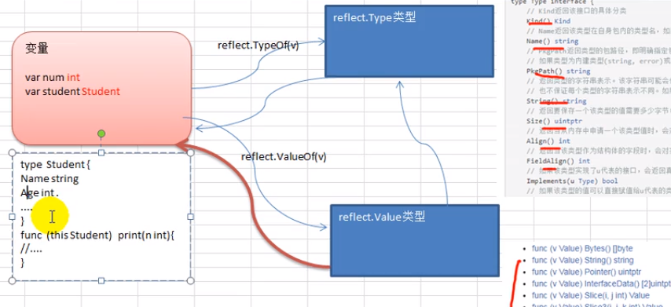
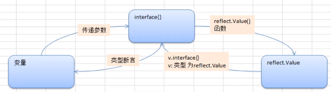

## 4.4 核心编程: 反射(reflect)

#### 1. 基本介绍

<https://studygolang.com/pkgdoc>



**a) 背景**     
反射（reflection）是在 Java 出现后迅速流行起来的一种概念，通过反射可以获取丰富的类型信息，并可以利用这些类型信息做非常灵活的工作。 大多数现代的高级语言都以各种形式支持反射功能，反射是把双刃剑，功能强大但代码可读性并不理想，若非必要并不推荐使用反射。    

**b) 特点**      
1. Go 语言中反射是由 reflect 包提供支持的
2. 反射 第一个重要类型 reflect.TypeOf(变量名) 获取变量类型，返回 reflect.Type 类型
3. 反射 第二个重要类型 Value，reflect.ValueOf(变量名) 获取变量值，返回 reflect.TVaule 类型
4. 变量 / intreface{} / reflect.Value 是可以进行转换的

5. 编程中 使用最多的是类型(Type)，指的是原生数据类型。而种类(Kind)指的是对象归属的品种, 比如： 
   var num int =10  基本类型int的 type是int，kind也是int
   var stu Student  stu 的 type 是 pkg1.Student, kind 是 struct

6. 反射方式 获取变量，要求数据类型匹配，比如x是int，那就要用reflect.Value(x).Int()，否则会报panic
7. 反射方式 修改变量，注意使用 Setxx 方法来设置，需要通过对应指针类型完成，需要使用reflect.Value.Elem()


**c) 应用场景**   
1. 对结构体序列化时，如果结构体有tag，也会使用反射生成的字符串
2. 


**d) 反射三定律**   
1. 反射可以将接口类型变量 转换为“反射类型对象” 
2. 反射可以将 “反射类型对象”转换为 接口类型变量；
3. 如果要修改 “反射类型对象” 其类型必须是 可写的；

(reflect.TypeOf(i)/reflect.ValueOf(i) 返回的对象即反射类型对象)      
(不是接收变量指针创建的反射对象，是不具备『可写性』的)


#### 2. 基本操作



```
package main

import (
	"fmt"
	"reflect"
)

func reflectTest01(b interface{}) {
	// 1. 先获取reflect.Type
	rType := reflect.TypeOf(b)
	fmt.Println("rType type is ", rType)

	// 2. 获取 reflect.Value
	rVal := reflect.ValueOf(b)
	fmt.Printf("rVal value is %v  type is %T \n", rVal, rVal)

	n1 := 2 + rVal.Int()
	fmt.Printf("n1 type is %T  value is %v \n", n1, n1)

	// 3. 查看kind
	tkid := rType.Kind()
	vkid := rVal.Kind()
	fmt.Println("rtype kind is ", tkid, "rvalue kind is ", vkid)

	// 4. 开始转换流程，reflect.Type -> interface{} -> 原有类型
	iVal := rVal.Interface()
	n2 := iVal.(int) // 类型断言
	fmt.Printf("n2 type is %T  value is %v \n", n2, n2)
}

func reflectTest02(b interface{}) {
	// 1. 先获取reflect.Type
	rType := reflect.TypeOf(b)
	fmt.Println("rType type is ", rType)

	// 2. 获取 reflect.Value
	rVal := reflect.ValueOf(b)
	fmt.Printf("rVal value is %v  type is %T \n", rVal, rVal)

	// 3. 查看kind
	tkid := rType.Kind()
	vkid := rVal.Kind()
	fmt.Println("rtype kind is ", tkid, "rvalue kind is ", vkid)

	// 4. 开始转换流程，reflect.Type -> interface{} -> 原有类型
	iVal := rVal.Interface()
	fmt.Printf("iVal type is %T  value is %v \n", iVal, iVal) // 只在运行时是 struct，无法获取iVal.Name
	stu, ok := iVal.(Student)                                 // 类型断言，因不确定来自哪个结构体，最好用switch进行判断
	if ok {
		fmt.Printf("stu type is %T  value is %v  Name is %v\n", stu, stu, stu.Name)
	}

}

func reflectTest03(b interface{}) {
	// 2. 获取 reflect.Value
	rVal := reflect.ValueOf(b)
	fmt.Printf("rVal value is %v  type is %T \n", rVal, rVal)

	rVal.Elem().SetInt(20)
	// 相当于 n := 10 , ptr *int = &n , n2 := *ptr
}

//Student test
type Student struct {
	Name string
	Age  int
}

//Student2 提供 类型断言时的干扰，无法确定是哪个结构体的类型
type Student2 struct {
	Name string
	Age  int
}

func main() {
	// 1. 对基本数据进行 变量 / intreface{} / reflect.Value 转换
	fmt.Println("----------------对基础类型进行转换-------------------")
	var num int = 100
	reflectTest01(num)

	// 2. 对结构体进行转换
	fmt.Println("----------------对结构体进行转换-------------------")
	stu := Student{
		Name: "Tom",
		Age:  20,
	}
	reflectTest02(stu)

	// 3. 通过反射 改变外边变量的值
	fmt.Println("----------------反射 改变外边变量的值-------------------")
	var n int = 10
	reflectTest03(&n)
	fmt.Println("num = ", n)

}

>>>
----------------对基础类型进行转换-------------------
rType type is  int
rVal value is 100  type is reflect.Value
n1 type is int64  value is 102
rtype kind is  int rvalue kind is  int
n2 type is int  value is 100
----------------对结构体进行转换-------------------
rType type is  main.Student
rVal value is {Tom 20}  type is reflect.Value
rtype kind is  struct rvalue kind is  struct
iVal type is main.Student  value is {Tom 20}
stu type is main.Student  value is {Tom 20}  Name is Tom
----------------反射 改变外边变量的值-------------------
rVal value is 0xc000012108  type is reflect.Value
num =  20
```

#### 3. 应用实践

1. 使用反射遍历结构体字段，调用结构体方法，获取结构体标签的值
2. 使用反射遍历结构体字段，调用结构体方法，修改结构体字段值
4. 使用反射操作任意结构体类型


