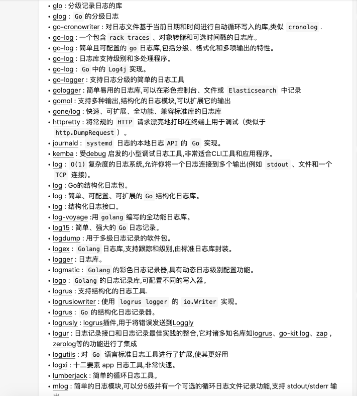

## 2.1.3 三方库: 输入输出(log)

大神整理：<https://www.zhihu.com/question/269427438>



```
golang 自家的日志框架特别简单，仅提供了print、panic、fatal三类函数
所以催生了很多三方日志库
用的比较多的是 logrus、zap、zerolog、seelog

logrus: start最多，性能高效，强大灵活，prometheus/docker等都在用它
zap: uber推出的快速结构化的分级日志库，有强大的ad-hoc分析性能。
seelog: 灵活的异步调用，格式化和过滤功能

```

#### 1. 自家 log

```

log.Println("这是一条优雅的日志。")
log.Printf("这是一个%s日志\n", "优雅的")

//fatal系列函数会在写入日志信息后调用os.Exit(1)。Panic系列函数会在写入日志信息后panic
log.Fatalln("这是一天会触发fatal的日志")
log.Panicln("这是一个会触发panic的日志。") //执行后会自动触发一个异常

// Flags函数会返回标准logger的输出配置
log.SetFlags(log.Llongfile | log.Lmicroseconds | log.Ldate)
log.Println("这是一条优雅的日志。")

// SetPrefix函数用来设置输出前缀
log.SetPrefix("[PS]")
log.Println("这是一条很普通的日志。")

// out属性是一个io.Writer输出流，使用它可以把日志输出为文件。
logFile, _ := os.OpenFile("./xx.log", os.O_CREATE|os.O_WRONLY|os.O_APPEND, 0644)
log.SetOutput(logFile)
log.SetFlags(log.Llongfile | log.Lmicroseconds | log.Ldate)

// 创建新logger对象的构造函数 New
logger := log.New(os.Stdout, "<PS>", log.Lshortfile|log.Ldate|log.Ltime)
logger.Println("这是自定义的logger记录的日志。")


>>>
2020/07/14 22:42:29 这是一条优雅的日志。
2020/07/14 22:42:29 这是一个优雅的日志

2020/07/14 22:42:29 这是一天会触发fatal的日志
异常退出

2020/07/14 22:51:06.079594 D:/go_workspace/src/leaning_go/src/main/test_log.go:24: 这是一条优雅的日志。

[PS]2020/07/14 22:56:15.652555 D:/go_workspace/src/leaning_go/src/main/test_log.go:26: 这是一个普通的日志


file ....

<PS>2020/07/14 23:02:59 test_log.go:43: 这是自定义的logger记录的日志
```

#### 2. logrus

logrus 是个可插拔的结构化的日志框架  
<https://github.com/sirupsen/logrus>

##### 1. 基础操作

```
特点：
1. 完全兼容的日志级别：debug、info、warn、error、fatal、panic
2. 可扩展的hook机制：允许使用者通过hook的方式将日志分发到任意地方
3. 可选的日志输出格式：JSONFormatter、TextFormatter、自定义Formatter
4. Field机制: logrus 通过 fields 进行精细化结构化的日志记录

tips：
因为完全兼容，所以可用 log "github.com/sirupsen/logrus" 直接替换
```

```
// 设置日志格式为json格式
log.SetFormatter(&log.JSONFormatter{})

// 设置将日志输出到标准输出（默认的输出为stderr，标准错误）
// 日志消息输出可以是任意的io.writer类型
log.SetOutput(os.Stdout)

// 设置日志级别为warn以上
log.SetLevel(log.WarnLevel)

// 日志格式化
requestLogger := log.WithFields(log.Fields{
  "event": event,
  "topic": topic,
  "key": key,
})
requestLogger.Info("aaaaa")
requestLogger.Fatal("Failed to send event")

```

```
示例一：
package main

import (
  log "github.com/sirupsen/logrus"
)

func main() {
  log.WithFields(log.Fields{
    "animal": "walrus",
  }).Info("A walrus appears")
}

>>>
time="2018-08-11T15:42:22+08:00" level=info msg="A walrus appears" animal=walrus


示例二：实例化工程方式
package main

import (
	"github.com/sirupsen/logrus"
	"os"
)

// logrus提供了New()函数来创建一个logrus的实例。
// 项目中，可以创建任意数量的logrus实例。
var log = logrus.New()

func main() {
    // 为当前logrus实例设置消息的输出，同样地，
    // 可以设置logrus实例的输出到任意io.writer
	log.Out = os.Stdout

    // 为当前logrus实例设置消息输出格式为json格式。
    // 同样地，也可以单独为某个logrus实例设置日志级别和hook，这里不详细叙述。
    log.Formatter = &logrus.JSONFormatter{}

	log.WithFields(logrus.Fields{
		"animal": "walrus",
		"size":   10,
	}).Info("A group of walrus emerges from the ocean")
}

```
