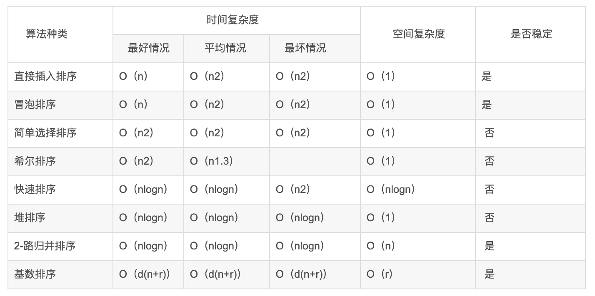
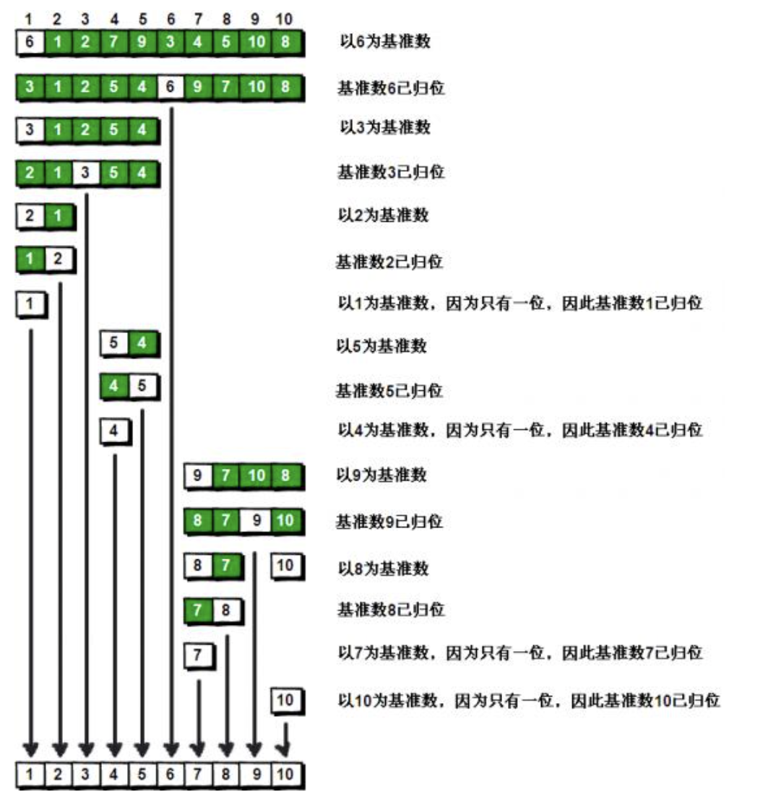
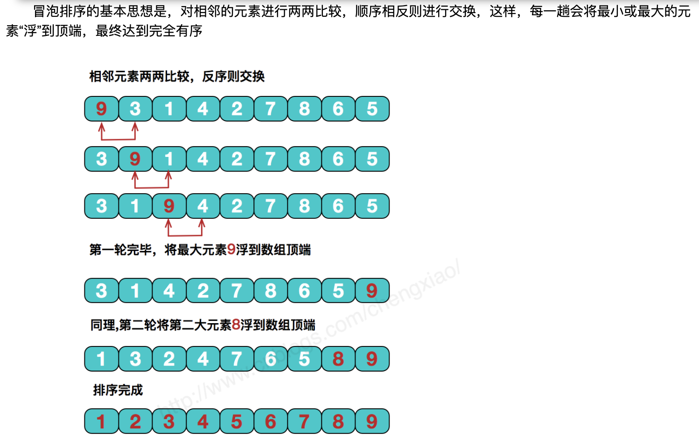
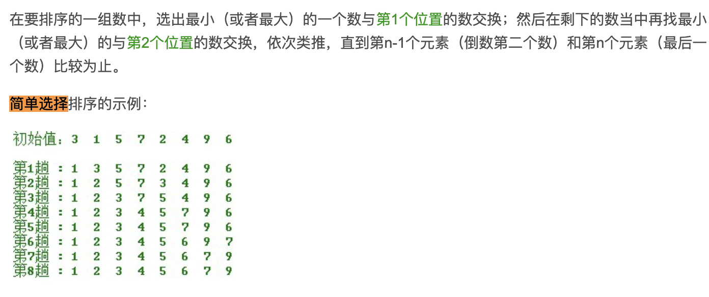
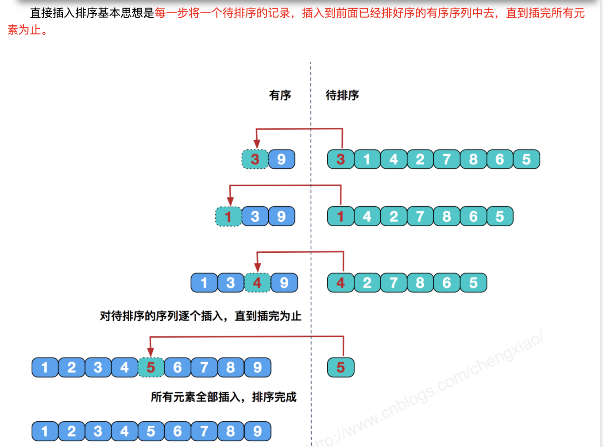

## 2.001 排序: 原理简介

一种排序算法，最早由东尼·霍尔提出

#### 1. 简介

内部排序：内存中排序  
a. 插入排序 (直接插入/希尔排序)  
b. 选择排序 (简单选择/堆排序)  
c. 交换排序 (冒泡排序/快速排序)  
d. 归并排序  
e. 基数排序

外部排序：内存和外部存储结合  
a. 合并排序  
b. 直接合并排序

```
冒泡排序 循环比较相邻的，小的放前边
选择排序 循环比较后面的，小的放前边
插入排序 循环比较前面的，小的放前边


交换--冒泡排序：性能差 O(n^2)
1. 不断比较两个相邻的元素，然后根据大小不断的交换位置
2. 每一轮下来最大的或者最小的值就会在末尾了
3. 执行 n-1 轮这个过程就好了

选择--简单选择：性能中 0(n^2)
每一趟从待排序的数据中选最小(最大)的元素作为首元素
1. 拿第n(n=1)个数作为最小值
2. 然后和 n+1及后面所有的数依次比较, 小的移动到前面替换
3. 然后再拿第n个数 和 n+1及后面所有的数依次比较, 小的移动到前面替换
4. 循环执行

插入--直接插入：性能较好 0(n) < x < O(n^2)
每一步将一个待排序的记录，插入到前面已经排好序的序列中。
1. 拿第n个数作为最小值 (n=2)
2. 然后和 n-1及前边所有的数依次比较, 小的移动到前面替换
3. 然后再拿第n+1个数 和 n+1-1及前边所有的数依次比较, 小的移动到前面替换
4. 循环执行

交换--快速排序：性能好
1. 找到基准点（通常使用数组的开头）
2. 把基准点后面的值进行与基准值比较，如果比基准小就放入左侧，否则放入右侧
3. 将基准的 左右侧 分别组合成新数组
4. 在分别从左右侧数组找一个基准，递归执行上面的步骤


```



#### 2. 交换: 快速排序

快速排序实现方式已经很多，但最最重要的还是理解递归的思想，然后合理设计递归函数



#### 3. 交换: 冒泡排序



#### 4. 选择: 简单选择


<https://blog.csdn.net/weixin_40925514/article/details/105840954>

#### 5. 插入: 直接插入


<https://blog.csdn.net/weixin_38380313/article/details/89605973>

#### 6. 归并排序
