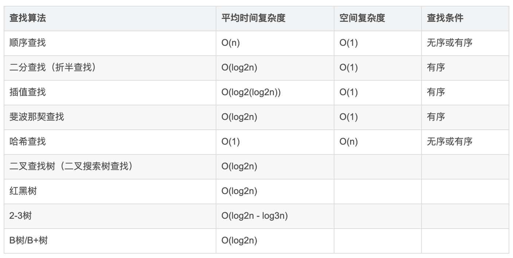

## 3.001 查找: 原理简介

#### 1. 简介


参考: <https://blog.csdn.net/weixin_41055260/article/details/109291253>

```
顺序查找
1. 从一端开始，依次与指定的值对比
2. 找到则返回，没找到则返回-1

二分查找
1. 确定查找的范围，low=0 high=n-1，mid=(low+high)/2
2. 若mid==x或者low>=high，则结束查找，否则继续
3. mid<x, 则[mid, high]在查找 ；若mid>x, 则[low, mid]中查找

arr 必须是个有序数组，从小到大或者从大到小

插值查找

裴波那契查找

哈希查找

二叉树查找

2-3树

红黑树

B/B+树

```
