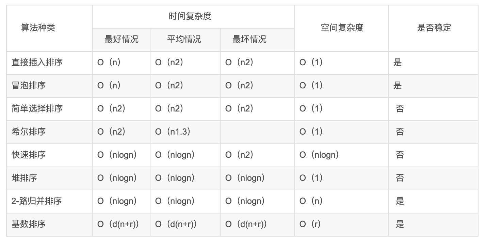
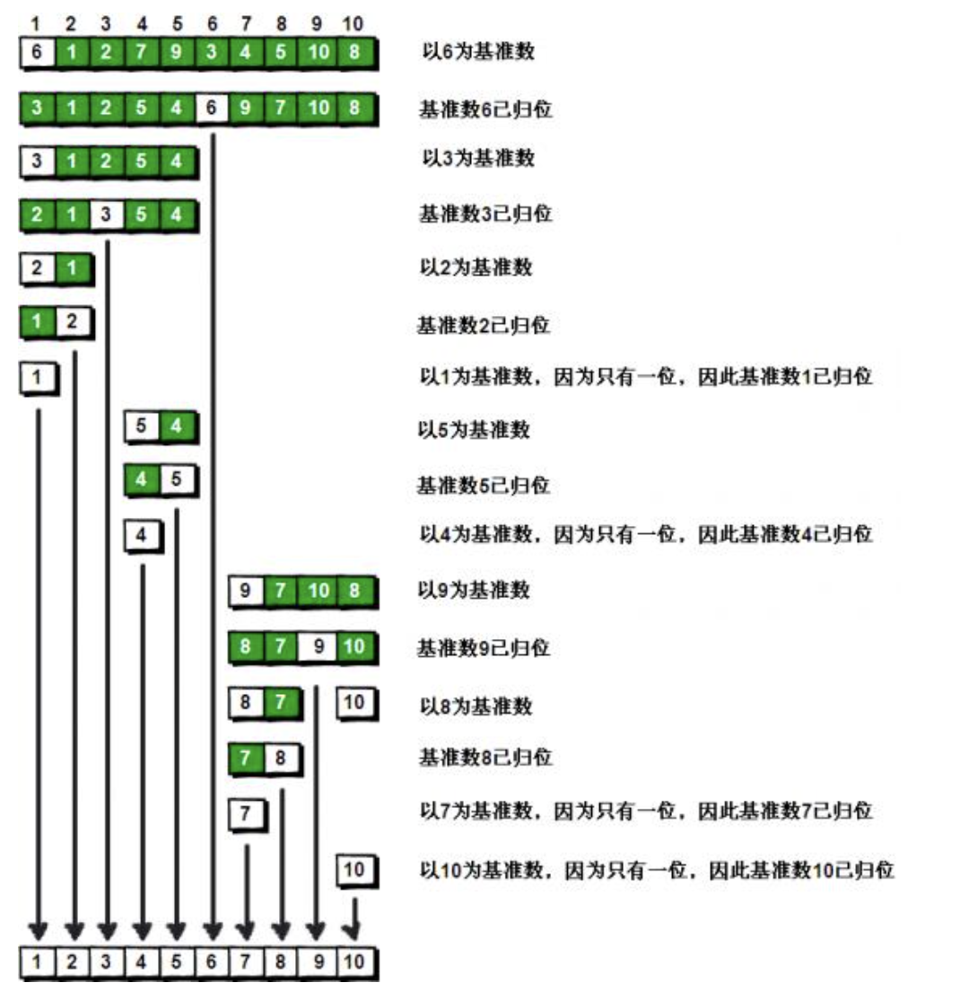

## 3.001 排序: 快速排序

一种排序算法，最早由东尼·霍尔提出

#### 1. 简介

内部排序：内存中排序  
a. 插入排序 (直接插入/希尔排序)  
b. 选择排序 (简单选择/堆排序)  
c. 交换排序 (冒泡排序/快速排序)  
d. 归并排序  
e. 基数排序

外部排序：内存和外部存储结合  
a. 合并排序  
b. 直接合并排序

```
冒泡排序 循环比较相邻的，小的放前边
选择排序 循环比较后面的，小的放前边
插入排序 循环比较前面的，小的放前边
```

```
冒泡排序：性能差 O(n^2)
1. 不断比较两个相邻的元素，然后根据大小不断的交换位置
2. 每一轮下来最大的或者最小的值就会在末尾了
3. 执行 n-1 轮这个过程就好了

简单选择：性能中 0(n^2)
每一趟从待排序的数据中选最小(最大)的元素作为首元素
1. 拿第n(n=1)个数作为最小值
2. 然后和 n+1及后面所有的数依次比较, 小的移动到前面替换
3. 然后再拿第n个数 和 n+1及后面所有的数依次比较, 小的移动到前面替换
4. 循环执行

直接插入：性能较好 0(n) < x < O(n^2)
每一步将一个待排序的记录，插入到前面已经排好序的序列中。
1. 拿第n个数作为最小值 (n=2)
2. 然后和 n-1及前边所有的数依次比较, 小的移动到前面替换
3. 然后再拿第n+1个数 和 n+1-1及前边所有的数依次比较, 小的移动到前面替换
4. 循环执行

归并排序：


快速排序：性能好
1. 找到基准点（通常使用数组的开头）
2. 把基准点后面的值进行与基准值比较，如果比基准小就放入左侧，否则放入右侧
3. 将基准的 左右侧 分别组合成新数组
4. 在分别从左右侧数组找一个基准，递归执行上面的步骤


```



#### 2. 原理

快速排序实现方式已经很多，但最最重要的还是理解递归的思想，然后合理设计递归函数



#### 3. go

```
package main

import (
	"fmt"
	"math/rand"
)

func main() {
	data := []int{}
	for i := 0; i < 6; i++ {
		data = append(data, rand.Intn(100))
	}
	fmt.Println("data=", data)
	quickSort(data)
}
func quickSort(arr []int) []int {
	n := len(arr)
	//如果n为1，即数组只要一个元素，不需要排序，返回即可
	if n < 2 {
		return arr
	} else {
		middle := arr[0] //获取比较的参考值（基准值）
		var left []int   //小于基准值的数据组成的切片
		var right []int  //大于基准值的数据组成的切片
		for i := 1; i < n; i++ {
			if arr[i] < middle {
				left = append(left, arr[i]) //小于基准值的数据归类
			} else {
				right = append(right, arr[i]) //大于基准值的数据归类
			}
			fmt.Printf("middle=%v left=%v right=%v\n", middle, left, right)
		}

		// 返回值为：递归小于部分 + 基准值  +  递归大于部分

        leftSlice := quickSort(left)
		rightSlice := quickSort(right)

		res := append(leftSlice, middle)
		// fmt.Println("1 res=", res)
		for _, data := range rightSlice {
			res = append(res, data)
			// fmt.Println("2 res=", res)
		}

		fmt.Println("res=", res)
		return res
	}

}
>>>
data= [81 87 47 59 81 18]
middle=81 left=[] right=[87]
middle=81 left=[47] right=[87]
middle=81 left=[47 59] right=[87]
middle=81 left=[47 59] right=[87 81]
middle=81 left=[47 59 18] right=[87 81]
middle=47 left=[] right=[59]
middle=47 left=[18] right=[59]
res= [18 47 59]
middle=87 left=[81] right=[]
res= [81 87]
res= [18 47 59 81 81 87]

```

#### 4. js

```
const innerQuickSort = (arr) => {
    if (arr.length <= 1) return arr;

    const left = [];
    const right = [];
    const middle = arr[0];
    // 从当前数组的第二项开始与基准点进行比较
    for (let i = 1; i < arr.length; i ++) {
        if (arr[i] < middle) {
        left.push(arr[i]);
        } else {
        right.push(arr[i]);
        }
        console.log("middle=",middle, " left=",left, " right=",right)
    }
    // 进行递归
    const orderLeft = innerQuickSort(left);
    const orderRight = innerQuickSort(right);
    // 将排序好的数组组合在一起
    const res = [...orderLeft, middle, ...orderRight]
    console.log("res=", res)
    return res
};

var arr = new Array()
for (let i = 0 ; i < 5; i++) {
    arr.push(Math.floor(Math.random()*50))
}
console.log("arr=",arr)

innerQuickSort(arr)

>>>
arr= [ 24, 48, 22, 39, 14 ]
middle= 24  left= []  right= [ 48 ]
middle= 24  left= [ 22 ]  right= [ 48 ]
middle= 24  left= [ 22 ]  right= [ 48, 39 ]
middle= 24  left= [ 22, 14 ]  right= [ 48, 39 ]
middle= 22  left= [ 14 ]  right= []
res= [ 14, 22 ]
middle= 48  left= [ 39 ]  right= []
res= [ 39, 48 ]
res= [ 14, 22, 24, 39, 48 ]
```
