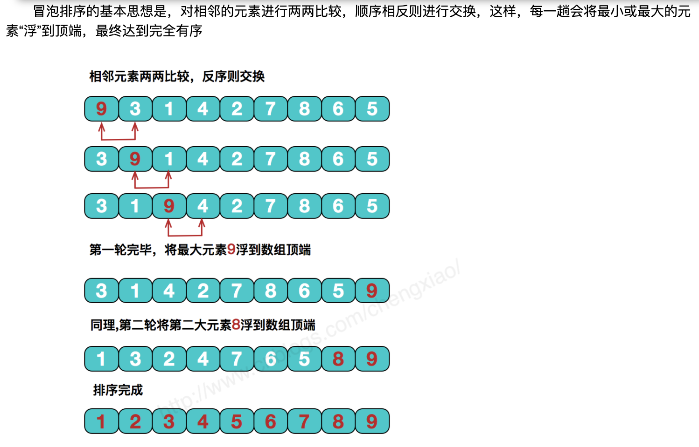

## 3.002 排序: 冒泡排序

#### 1. 原理



#### 2. go

```
package main

import (
	"fmt"
	"math/rand"
)

func main() {
	data := []int{}
	for i := 0; i < 6; i++ {
		data = append(data, rand.Intn(100))
	}
	fmt.Println("data=", data)
	quickSort(&data)
}

func quickSort(arr *[]int) {
	n := len(*arr)

	fmt.Printf("暴力排序前arr=%v\n", (*arr))
	// 第一轮排序 (内层比较4次)
	for j := 0; j < n-1; j++ {
		if (*arr)[j] > (*arr)[j+1] {
			// 交换
			t := (*arr)[j]
			(*arr)[j] = (*arr)[j+1]
			(*arr)[j+1] = t
		}
	}
	fmt.Printf("暴力一轮后arr=%v\n", *arr)

	// 第二轮排序 (内层比较3次)
	for j := 0; j < n-2; j++ {
		if (*arr)[j] > (*arr)[j+1] {
			// 交换
			t := (*arr)[j]
			(*arr)[j] = (*arr)[j+1]
			(*arr)[j+1] = t
		}
	}
	fmt.Printf("暴力二轮后arr=%v\n", *arr)

	// 循环冒泡
	fmt.Printf("冒泡排序前arr=%v\n", *arr)
	for i := 0; i < n-1; i++ {
		for j := 0; j < n-i-1; j++ {
			if (*arr)[j] > (*arr)[j+1] {
				t := (*arr)[j]
				(*arr)[j] = (*arr)[j+1]
				(*arr)[j+1] = t
			}
		}
		fmt.Printf("冒泡排序后arr=%v\n", *arr)
	}
	// fmt.Printf("冒泡排序后arr=%v\n", *arr)
}

>>>
暴力排序前arr=[81 87 47 59 81 18]
暴力一轮后arr=[81 47 59 81 18 87]
暴力二轮后arr=[47 59 81 18 81 87]
冒泡排序前arr=[47 59 81 18 81 87]
冒泡排序后arr=[47 59 18 81 81 87]
冒泡排序后arr=[47 18 59 81 81 87]
冒泡排序后arr=[18 47 59 81 81 87]
冒泡排序后arr=[18 47 59 81 81 87]
冒泡排序后arr=[18 47 59 81 81 87]
```

#### 3. js

```
// 构造数组 quickSort 方法
//Array.prototype.quickSort = () => {
Array.prototype.quickSort   = function() {
    for (let i = 0; i<arr.length-1; i++) {
        for (let j = 0; j < arr.length-1-i; j++ ) {
            if (arr[j] > arr[j+1]) {
                const tmp = arr[j]
                arr[j] = arr[j+1]
                arr[j+1] = tmp
            }
        }
        console.log("res=",arr)
    }
};

var arr = new Array()
for (let i = 0 ; i < 6; i++) {
    arr.push(Math.floor(Math.random()*50))
}
console.log("arr=",arr)

arr.quickSort()

>>>
arr= [ 44, 14, 28, 11, 39, 22 ]

res= [ 14, 28, 11, 39, 22, 44 ]
res= [ 14, 11, 28, 22, 39, 44 ]
res= [ 11, 14, 22, 28, 39, 44 ]
res= [ 11, 14, 22, 28, 39, 44 ]
res= [ 11, 14, 22, 28, 39, 44 ]
```
