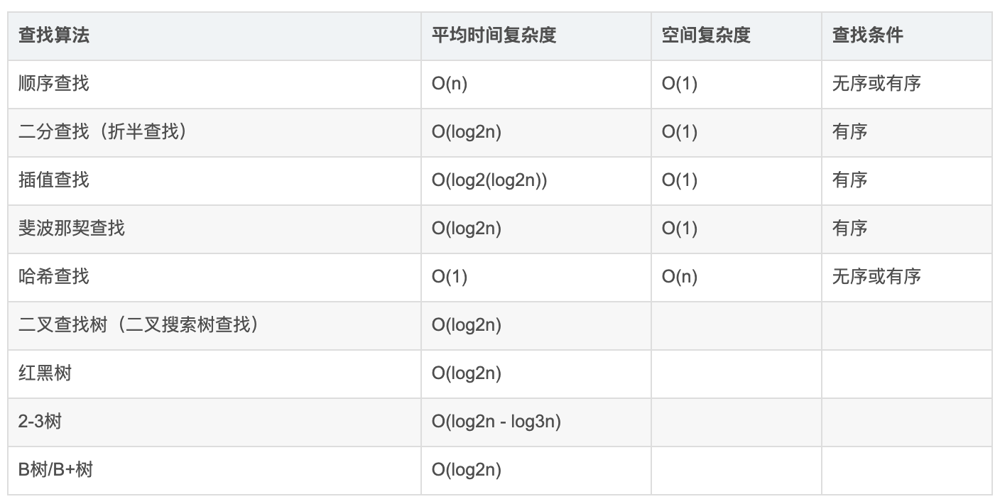

## 4.001 查找: 二分查找

<https://leetcode-cn.com/problems/binary-search/>

#### 1. 简介


参考: <https://blog.csdn.net/weixin_41055260/article/details/109291253>

```
顺序查找
1. 从一端开始，依次与指定的值对比
2. 找到则返回，没找到则返回-1

二分查找
1. 确定查找的范围，low=0 high=n-1，mid=(low+high)/2
2. 若mid==x或者low>=high，则结束查找，否则继续
3. mid<x, 则[mid, high]在查找 ；若mid>x, 则[low, mid]中查找

arr 必须是个有序数组，从小到大或者从大到小

插值查找

裴波那契查找

哈希查找

二叉树查找

2-3树

红黑树

B/B+树

```

#### 2. 顺序查找

```
package main
import "fmt"

func main() {
    // 初始化条件
    names := [4]string{"岳云鹏", "宋小宝", "沈腾", "马云"}
    var boss = ""
    fmt.Println("请输入要查找的人名.......")
    fmt.Scanln(&boss)

    // 第一种方式
    for i := 0; i < len(names); i++ {
        if boss == names[i] {
            fmt.Printf("boss = names[%v] = %v\n", i, boss)
            break
        } else if i == len(names) - 1 {
            fmt.Println("没找到")
        }
    }

    // 第二种方式
    fmt.Scanln(&boss)

    index := -1

    for i := 0; i < len(names); i++ {
        if boss == names[i] {
            index = i
            break
        }
    }
    //if index != -1 {
    fmt.Printf("boss = names[%v] = %v\n", index, boss)
    //}

}

>>>
输入要查找的人名.......
马云
boss = names[3] = 马云
xxx
boss = names[-1] = xxx

```

#### 2. 二分查找

```
package main
import "fmt"

func BinaryFind(arr *[6]int, leftIndex int, rightIndex int, value int) {

    if leftIndex > rightIndex {
        fmt.Println("没找到......")
        return
    }

    mid := (leftIndex + rightIndex) / 2

    // 因为传进来的是地址，要进行值判断，所以需要用指针把地址对应的值取出来
    if (*arr)[mid] > value {
        BinaryFind(arr, leftIndex, mid - 1, value)
    } else if (*arr)[mid] < value {
        BinaryFind(arr, mid + 1 , rightIndex, value)
    } else {
        fmt.Printf("找到了value = %v = arr[%v]\n", value, mid)
    }
}

func main() {
    arr := [6]int{1, 8, 10, 20, 50, 100}

    BinaryFind(&arr, 0, len(arr)-1, 20)   //BinaryFind 形参是指针(引用类型)，所以要把地址传进去

    BinaryFind(&arr, 0, len(arr)-1, 30)
}

>>>
找到了value = 20 = arr[3]
没找到......
```
